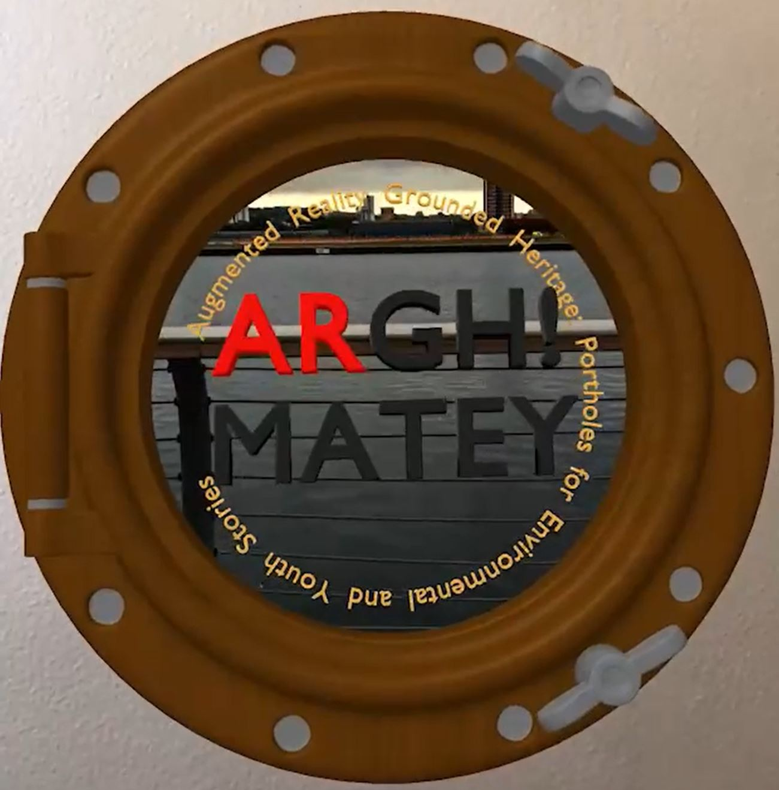

# ARGH! Mateys :anchor:

*Augmented Reality Grounded Heritage: Portholes for Environmental and Youth Stories*

---
:earth_africa: [https://ucl-casa-ce.github.io/ARGH](https://ucl-casa-ce.github.io/argh)
:earth_africa: [https://ar.arghmateys.org/](https://ar.arghmateys.org/)
:scroll: [https://arghmateys.org/](https://arghmateys.org/)

---

## Description:

__ARGH! Mateys__ invites people to walk and discover new writing by young people hidden in digital portholes located throughout the Royal Docks. Find AR markers and keywords installed on site at locations chosen by local young people, and use them to explore new writing and spoken word poetry as an WebAR experience or via SMS text message. An interactive web map has been created to support a lockdown-safe experience using the Memory Mapper toolkit developed at CASA :scroll: [https://arghmateys.org/](https://arghmateys.org/)

Capturing and transmitting the voices from the Royal Docks, _ARGH! Mateys_ has been created by researchers from UCL's [Connected Environment's Lab](https://connected-environments.org/) together with young people from Youth Empowerment, Fight for Peace, West Silvertown Foundation and Royal Docks Learning Activity Centre. This project builds on previous EPSRC PETRAS-funded research to enable objects in outdoor spaces to converse, from talking trees to a tour of Wordsworth's poems and conversational gnomes in Stratford’s Queen Elizabeth Olympic Park.
_ARGH! Mateys_ was commissioned by the Royal Docks for Join the Docks Autumn Festival 2020. 

## Notes
- The AR experience works with any camera equipped smartphones and tablet (Android >4.4 or iOS >11) up to 4-year-old (due to CPU and GPU performance)
- on iOS only Safari is supported
- on Android, Chrome is the suggested browser  

## Technologies and libraries used

- [AFrame](https://aframe.io/)
- [AR.JS](https://github.com/AR-js-org/AR.js/)
- [Howler](https://howlerjs.com/)

